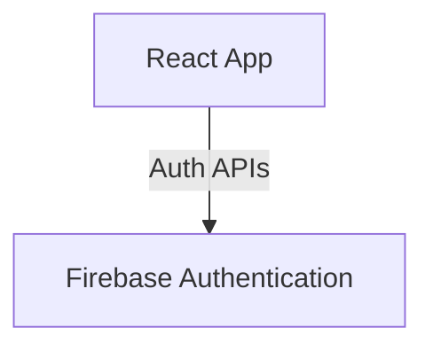

# React Firebase Material UI Auth

Simple auth starter using Firebase Authentication + Material UI (login, register, reset password).
使用 Firebase Authentication 與 Material UI 的簡單登入/註冊/重設密碼範例。

## ✨ Features
- Email/Password 註冊、登入、登出
- 密碼重設信件
- Material UI 介面
- React Router 路由

## 🚀 Quick Start

### Prerequisites
- Node.js >= 18
- Yarn (或 npm)
- Firebase 專案（已啟用 Authentication）

### Installation
```bash
yarn install
```

### Configuration
```bash
cp .env.example .env
# 編輯 .env 填入你的 Firebase Web 設定
```

需要的環境變數：
- `REACT_APP_FIREBASE_API_KEY`
- `REACT_APP_FIREBASE_AUTH_DOMAIN`
- `REACT_APP_FIREBASE_PROJECT_ID`
- `REACT_APP_FIREBASE_STORAGE_BUCKET`
- `REACT_APP_FIREBASE_MESSAGING_SENDER_ID`
- `REACT_APP_FIREBASE_APP_ID`
- `REACT_APP_FIREBASE_MEASUREMENT_ID` (選填)
- `REACT_APP_FIREBASE_DATABASE_URL` (若使用 Realtime Database)

### Run
```bash
yarn start
```

## 📖 Usage
啟動後可用以下路由：
- `/` 首頁（登入狀態會顯示不同內容）
- `/login` 登入
- `/register` 註冊
- `/reset-password` 重設密碼
- `/logout` 登出

## 🏗️ Architecture
前端 React App 直接呼叫 Firebase Authentication。



## 📄 License
MIT License. See `LICENSE`.
